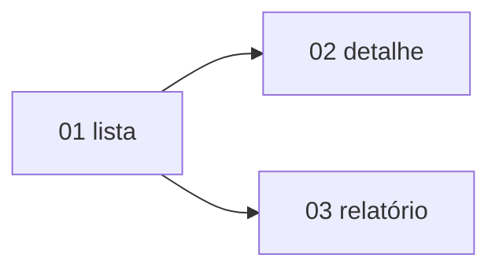

# Épico: <título da iniciativa>

**Origem:** `planning/<iniciativa>/intake.md`

## Contexto (B1)
- Problema macro:
- O que a iniciativa entrega:
- **AS-IS** (como é hoje):
- **TO-BE** (como fica):
- **Fora de escopo:**

## Públicos e jornadas (B2)
| Público | Jornada (passos → candidatos a tela) |
|---|---|
|  |  |

## Backlog de telas (B3)
> Cada item vira uma `px-request`. Aqui é só recorte + objetivo — sem campos/estados/copy.

### 01 — <nome-tela> (kebab-case)
- **Objetivo (1 linha):**
- **Público(s):**
- **Tamanho:** P | M | G
- **Família provável (palpite):** <ex: Data Table — variação decidida na px-request>
- **Depende de:** --
- **Status:** [ ] Não iniciada

### 02 — <nome-tela>
- **Objetivo:**
- **Público(s):**
- **Tamanho:**
- **Família provável:**
- **Depende de:** 01
- **Status:** [ ] Não iniciada

## Roadmap (B4)

- Caminho crítico:
- Em paralelo:

## Riscos (B5)
| Risco | Mitigação |
|---|---|
|  |  |

## Critério de aceite do épico (B5)
- [ ] <verificável no nível da iniciativa inteira>

## Premissas registradas
- [ ] <default assumido>

## Perguntas em aberto (bloqueiam detalhar alguma tela)
- [ ] <pergunta> — dono:

## Definition of Ready do épico (B6)
- [ ] Contexto: AS-IS / TO-BE / fora de escopo
- [ ] Públicos + jornadas
- [ ] Backlog: cada tela com nome, objetivo, público, tamanho
- [ ] Dependências + roadmap + caminho crítico
- [ ] Riscos com mitigação
- [ ] Critério de aceite do épico verificável
- [ ] Premissas registradas
- [ ] Perguntas em aberto com dono

## Próximo passo
- Começar a `px-request` pela primeira tela sem dependências.

<!-- Salvar em: planning/<iniciativa>/epics/NN-<epico>/00-overview.md -->
<!-- Cada tela vira: planning/<iniciativa>/epics/NN-<epico>/NN-<nome-tela>.md -->
